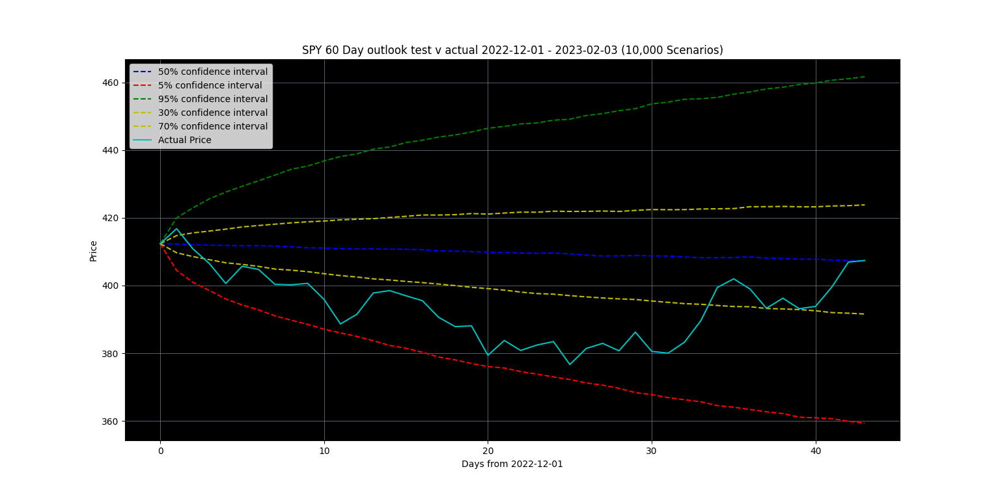
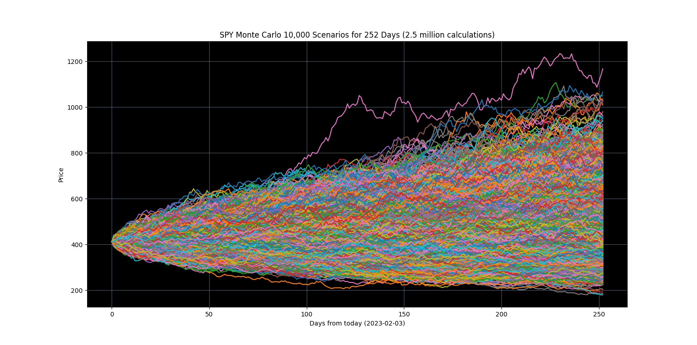

# Projects Portfolio

## Project 1 - Monte Carlo Risk Model (link to code)
- Utilizes pandas datareader to gather stock data 
- Looking at daily close price, calulates average daily move & standard deviation of average daily move
- Applies a random walk starting at current price and then applying a random variable to average daily move and standard deviation
- Scalable timeframes and number of simulations 
- Aggregates results from multiple random walks and visualizes the result 

## Project 2 - 
